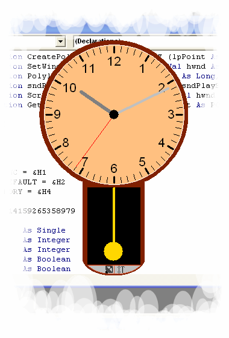



## A Real Clock

### Description

This is an analog clock. Its hands move like a battery-operated clock! You also have the option to show the second hand or not. You can minimize this application to the system tray as well! Other features include a swinging pendulum, hourly chime, and time synchronization with an atomic time server without using MSWINSCK.OCX (GUARANTEED ACCURACY)! Configurations include start-up on Windows start and setting the windows to be always on top. On load, the main form reshapes to the shape of the clock as you can see in the screenshot. It has ticks for easy time reading. If you like it, plz vote!!! :-P
 
### More Info
 

             |
---                |---
**Submitted On**   |2004-11-12 15:10:54
**By**             |[mathXpert](https://github.com/Planet-Source-Code/PSCIndex/blob/master/ByAuthor/mathxpert.md)
**Level**          |Intermediate
**User Rating**    |4.4 (22 globes from 5 users)
**Compatibility**  |VB 6\.0
**Category**       |[Miscellaneous](https://github.com/Planet-Source-Code/PSCIndex/blob/master/ByCategory/miscellaneous__1-1.md)
**World**          |[Visual Basic](https://github.com/Planet-Source-Code/PSCIndex/blob/master/ByWorld/visual-basic.md)
**Archive File**   |[A\_Real\_Clo18177611132004\.zip](https://github.com/Planet-Source-Code/mathxpert-a-real-clock__1-55261/archive/master.zip)

